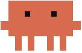
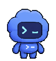

<h2>Hey, I'm Aarav. &nbsp; &nbsp;</h2>

I make useful things: AI systems, internal tools, and software that runs in production.

I like taking messy, annoying problems and making them a little easier to live with.

[Portfolio](https://aaravkashyapsingh.com) · [X / @byaarav](https://x.com/byaarav) · [LinkedIn](https://www.linkedin.com/in/aaravkashyapsingh) · [Email](mailto:hello@aaravkashyapsingh.com) · [Book a call](https://cal.com/aaravkashyap/meetings)

### Selected work

- **[Quill](https://github.com/AaravKashyap12/quill)** — Local-first voice dictation with optional AI cleanup.
- **[advise-project-approach](https://github.com/AaravKashyap12/advise-project-approach)** — A research workflow for making software decisions with evidence.
- **[TalentMatch](https://github.com/AaravKashyap12/TalentMatch)** — An AI recruiting copilot with evidence-backed candidate recommendations.
- **[CryptoQuant](https://github.com/AaravKashyap12/CryptoQuant)** — Crypto analytics, forecasts, and backtested strategies.

[More projects and notes →](https://aaravkashyapsingh.com/projects)

<!-- Mascot credits: Claude is Anthropic's mascot; this SVG reuses the local
     fan-art reconstruction used in the portfolio. Codex belongs to OpenAI;
     the GIF extracts the first six idle frames from their sprite sheet:
     https://persistent.oaistatic.com/codex/pets/v1/codex-spritesheet-v4.webp -->
